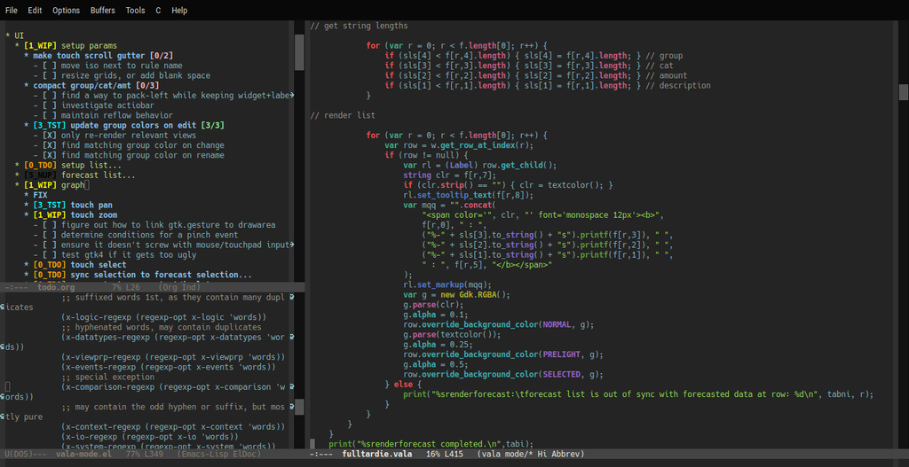

# valamode

*work in progress*

made for specific projects, word lists are far from complete

based on this article:

>How to Write a Emacs Major Mode for Syntax Coloring By Xah Lee. 2008-11-30  
>http://www.ergoemacs.org/emacs/elisp_syntax_coloring.html
